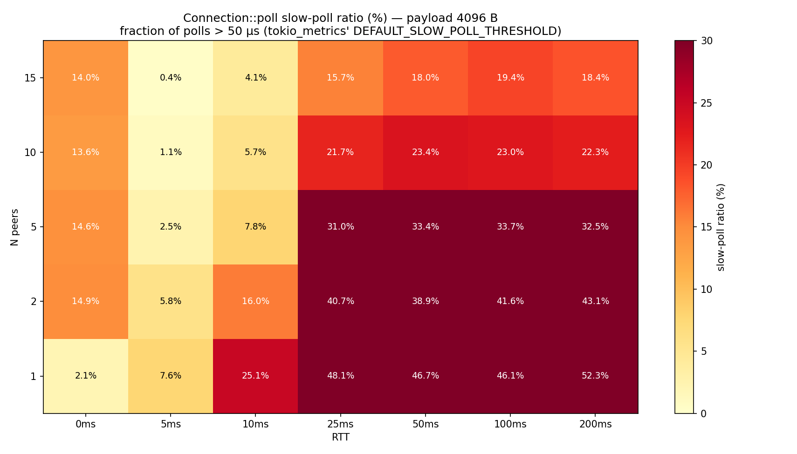
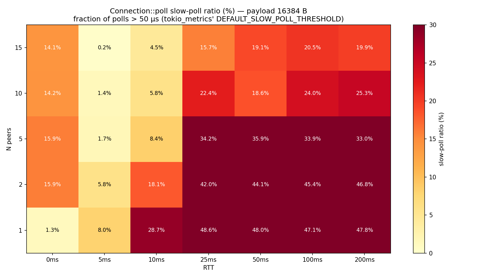
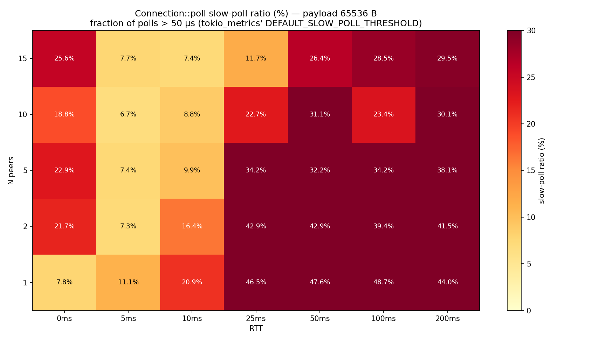
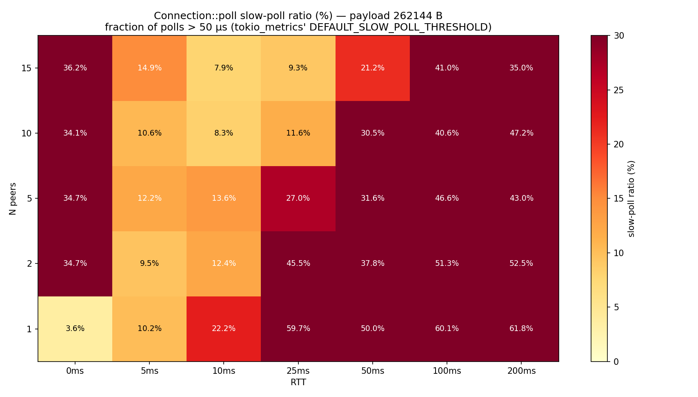
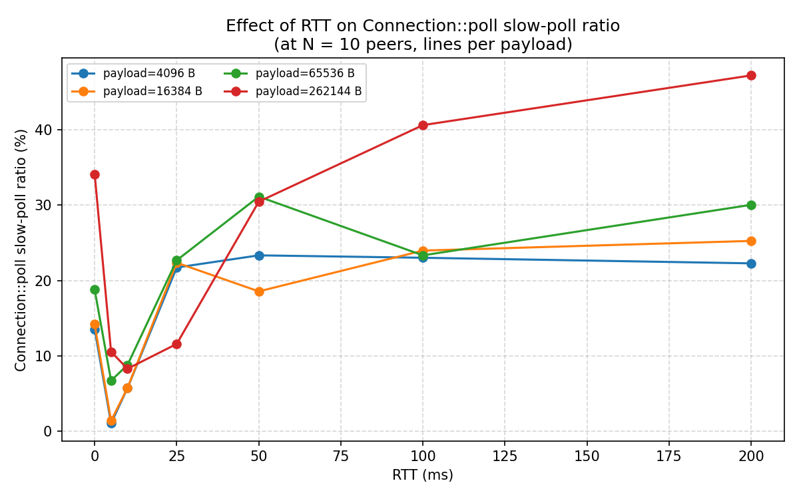
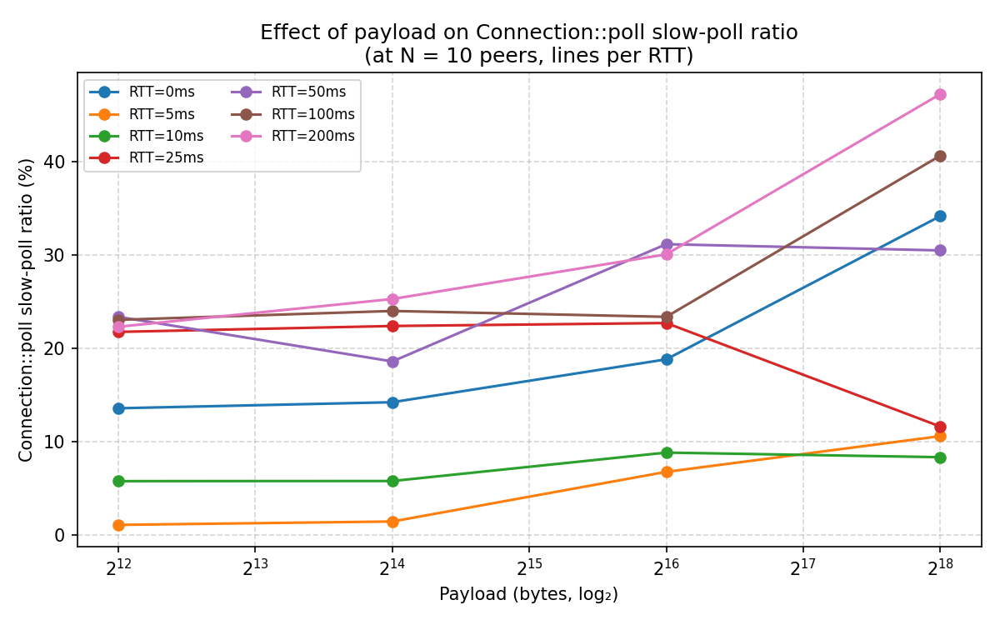
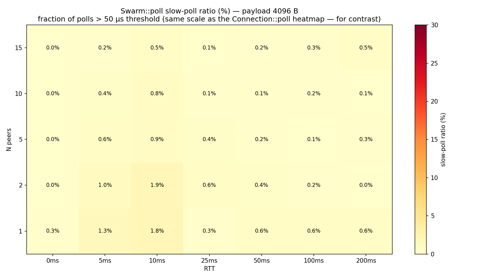
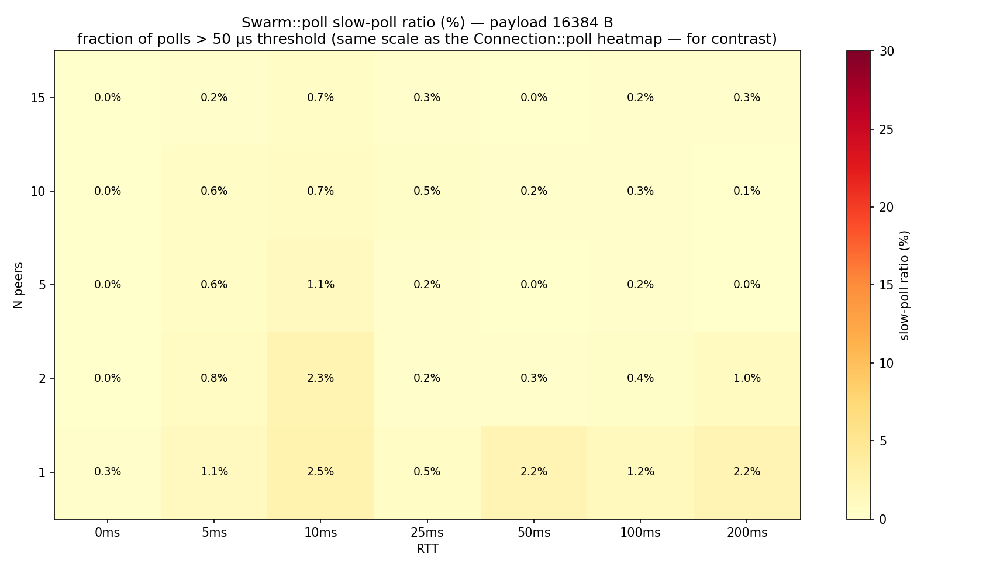
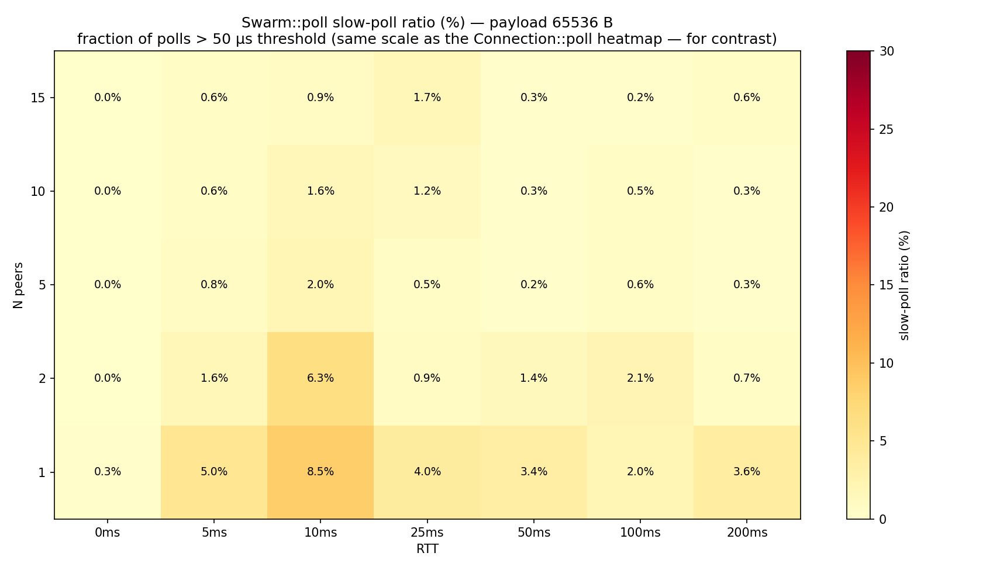
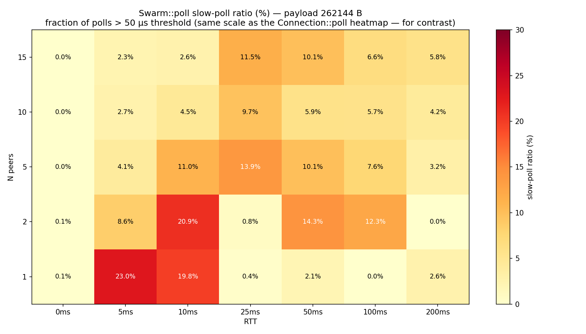

# `latency-benchmark`

A measurement tool for `libp2p`'s `Connection::poll` cooperative-scheduling
behaviour on a `tokio` runtime, over a real TCP + `tc netem` network stack.

## TL;DR — `Connection::poll` routinely exceeds Tokio's 50 µs slow-poll threshold

`tokio` is a cooperatively-scheduled runtime: a task is expected to yield
to the executor frequently so the worker can drive other tasks, timers,
and I/O events. `tokio-metrics` flags any single poll exceeding **50 µs**
as a *slow poll* — this is its
[`TaskMonitor::DEFAULT_SLOW_POLL_THRESHOLD`](https://docs.rs/tokio-metrics/latest/tokio_metrics/struct.TaskMonitor.html#associatedconstant.DEFAULT_SLOW_POLL_THRESHOLD).
The heatmaps below show, for each operating point in the grid, the
fraction of `Connection::poll` invocations that crossed that threshold —
the higher the colour, the more polls crossed the threshold.

This bench measures `Connection::poll` in `swarm/src/connection.rs:274` —
the inner fixed-point loop each per-connection tokio task runs — and finds:

- **At 138 of the 140 operating points we measured (N ∈ {1, 2, 5, 10, 15} ×
  RTT ∈ {0, 5, 10, 25, 50, 100, 200} ms × payload ∈ {4, 16, 64, 256} KiB),
  more than 1 % of `Connection::poll` invocations exceed the 50 µs
  threshold. The worst cells cross it 50–62 % of the time.** (The 2 cells
  below 1 % are at 4 KiB / RTT=5 ms / N=15 and 16 KiB / RTT=5 ms / N=15.)
- **Both axes drive the ratio.** At **256 KiB / RTT=200 ms / N=1** — a
  single idle WAN connection — `Connection::poll`'s slow-poll ratio
  hits **61.75 %** and p99 reaches **932 µs** (~19× the threshold).
  Polls are rare in this cell (≈17 per second), but nearly two-thirds
  of the ones that do happen exceed the threshold.
- **Under throughput pressure** (RTT=0, N ≥ 5, any payload), the ratio
  is 13–36 %, and that 36 % at 256 KiB / RTT=0 / N=15 translates to
  **~82 % of measurement wall-clock** held inside slow polls.
- At 64 KiB payload, even the cleanest single-peer cell (N=1, RTT=0)
  sits at 7.8 % slow-poll ratio.
- **`Swarm::poll_next_event` is two orders of magnitude smaller in
  absolute frequency.** Its ratio crosses 1 % in 51 of 140 cells
  (peaks at 23 %), but its worst-case slow polls/sec is **65** vs
  `Connection::poll`'s **6 933** — the ratio rises in the same
  low-throughput cells for the same statistical reason (few total polls,
  any heavy poll lifts the ratio). The slow-poll budget is attributable
  to the inner `Connection::poll` loop.

These aren't pathological edge cases — they reproduce on a single
loopback connection at 4 KiB. The long tail looks structural rather
than environmental.

## The headline evidence

### Slow-poll ratio across the grid

Heatmap of the slow-poll ratio (% of `Connection::poll` invocations
exceeding the 50 µs slow-poll threshold), one per payload size:

| 4 KiB | 16 KiB |
|---|---|
|  |  |

| 64 KiB | 256 KiB |
|---|---|
|  |  |

Reading these: the heatmaps light up along two distinct axes. The
**RTT=0 column** is hot at every payload and every N ≥ 2 (active
yamux framing constantly hands `Connection::poll` work to do, so the
poll-time distribution is bimodal). The **high-RTT × low-N corner**
is the *hottest* by ratio — at 256 KiB / RTT=200 ms / N=1 the bench
records only ≈17 polls per second, but **62 %** of them exceed the
threshold (the polls fire rarely, and when they do they're almost
always the heavy "request arrived, walk every child" path). Only
2 of 140 cells stay under the 1 % warning level.

### Isolating each factor

The two charts that put RTT and payload on the x-axis directly answer
"how does each factor affect the slow-poll ratio?":





- **Payload still pushes the ratio up at fixed N and RTT.** At N=10 /
  RTT=0 the ratio climbs 4 KiB → 256 KiB from 13.5 % to 34.2 %; at
  N=10 / RTT=200 ms it climbs 22.3 % to 47.2 %. Larger payloads mean
  more yamux frames per request and longer cascades through the
  fixed-point loop.
- **High RTT doesn't mitigate the ratio — it concentrates it.** When
  the link is fast, idle wake-checks dilute the heavy polls in the
  histogram, lowering the ratio. When the link is slow, the
  `Connection::poll` task is mostly woken by actual work arriving, so
  the polls that do fire are disproportionately heavy. At N=10 across
  64 KiB and 256 KiB, every RTT we tested has > 8 % slow ratio.

### Translating the ratio to wall-clock cost

The ratio doesn't tell you how often the worker is held back per
second of wall-clock — the high-RTT-low-N cells have alarming ratios
but few polls per second, so their absolute cost is small. The cells
where this *also* costs measurable wall-clock time are the
high-throughput ones (low RTT, N ≥ 2). At 256 KiB / RTT=0 / N=15 the
ratio is 36 %, polls fire at 4 642/s, each slow poll averages
~176 µs, and the worker thread spends **81.7 %** of measurement
wall-clock inside `Connection::poll` invocations crossing the
threshold. Computable from any row of `data/per_run.csv` as
`poll_slow_count × cn_mean_slow_poll_us / measurement_window`.

### Swarm::poll vs Connection::poll

The same `(N × RTT)` grid, this time coloured by the *Swarm::poll*
slow-poll ratio. Same metric, same threshold, same scale:

| 4 KiB | 16 KiB |
|---|---|
|  |  |

| 64 KiB | 256 KiB |
|---|---|
|  |  |

Read these against the `Connection::poll` heatmaps above and the
difference is *frequency*, not *fraction*. `Swarm::poll` does cross
1 % in 51 of 140 cells and peaks at **23 %** at 256 KiB / RTT=5 / N=1
— the same low-throughput cells where `Connection::poll`'s ratio also
peaks, for the same reason (few total polls, the ones that fire are
heavy). But the absolute rate is two orders of magnitude smaller:
`Swarm::poll`'s worst cell records **65 slow polls/s** vs
`Connection::poll`'s **6 933 slow polls/s**. In wall-clock terms,
`Swarm::poll` is below 1 % cost in every cell of the grid. The
inner per-connection-task loop is where the budget actually goes.

### What this costs co-tenant tokio tasks

Every µs spent inside `Connection::poll` is a µs the worker can't spend
on:

- driving the tokio I/O reactor (incoming TCP packets, accept/connect
  notifications) — so unrelated I/O is delayed,
- firing scheduled timers (`tokio::time::sleep`, `tokio::time::timeout`,
  rate-limiters, retry backoffs) — so they fire late,
- polling any other application task colocated on the same runtime — so
  any latency-sensitive co-tenant suffers tail-latency inflation.

At the *highest-throughput* observed cell — 256 KiB / RTT=0 / N=15,
the operating point that intra-region cloud / co-located peering
deployments actually look like — the per-second budget breakdown is:

- ≈ 192 268 `Connection::poll` invocations in 15 s
- 69 626 of those exceed the 50 µs threshold (**36.2 %**)
- average slow poll = 176 µs (`cn_mean_slow_poll_us`)
- → **4 642 slow polls/s × 176 µs ≈ 817 ms/s spent above the threshold**

That's **81.7 % of wall-clock** held inside threshold-crossing
`Connection::poll` invocations. The runtime is spending more time
inside slow polls than not.

At smaller cells the absolute cost shrinks but the ratio doesn't —
at 256 KiB / RTT=0 / N=1, wall-clock cost is 38.2 %; at 256 KiB
/ RTT=200 / N=1 it's 0.37 % even though the ratio is 62 %, because
that cell only fires ≈17 polls/s. The ratio is what's structurally
wrong; wall-clock is what makes it production-relevant on the cells
where polls fire often.

## Where the long polls come from

`Connection::poll` (`swarm/src/connection.rs:274`) is a fixed-point
iteration that walks every child sub-state-machine in turn, with
`continue` after each one that returns `Ready`, and only yields when
*every* child reports `Pending` simultaneously:

```rust
loop {
    if requested_substreams.poll_next() ready { continue; }
    if handler.poll()                  ready { continue; }
    if negotiating_out.poll_next()     ready { continue; }
    if negotiating_in.poll_next()      ready { continue; }
    if muxing.poll()                   ready { continue; }
    if muxing.poll_outbound()          ready { continue; }
    if muxing.poll_inbound()           ready { continue; }
    return Pending;
}
```

There is no upper bound on the work this loop can do per invocation.
Each child returning `Ready` triggers re-polling of every preceding
child. A single wakeup that lights up multiple children — a yamux frame
delivering data + a substream upgrade completing + a handler producing
an outbound event — cascades through the whole hierarchy before the
function returns. Each cascade is one tokio "poll" from the runtime's
view, and a long one exceeds the 50 µs slow-poll threshold.

The data above shows this cascade exceeds 50 µs in 13–36 % of polls
under high-throughput load (RTT=0, N ≥ 5, any payload) and 44–62 %
of polls in low-throughput cells where each connection is mostly
idle on the wire (N=1, RTT ≥ 25 ms, payloads ≥ 64 KiB) — the
high-RTT cells fire few polls per second, but most of the ones that
do fire are the heavy cascade.

## Plausible fix

A tokio-`coop`-style work budget on this loop bounds the per-invocation
work without changing observable behaviour beyond a self-wake on
saturation:

```rust
const POLL_WORK_BUDGET: u32 = 8;   // value to tune
let mut work_done: u32 = 0;
loop {
    if work_done >= POLL_WORK_BUDGET {
        cx.waker().wake_by_ref();
        return Poll::Pending;
    }
    work_done = work_done.saturating_add(1);
    // … existing children, unchanged …
}
```

Calibrating the budget is empirical — the bench doesn't measure
per-inner-iteration cost directly (only per-`Connection::poll`-call
cost). The right starting point is "budget = enough that idle and
small-payload cells stay near 0 slow polls, low enough that the worst
cells fall back under the 50 µs threshold," and adjust from there.
Children that returned `Pending` retain their wakers; children that
returned `Ready` get re-polled on next entry. Throughput-wise the only
cost is one extra runtime scheduling round per saturated poll, which
is small compared to the time the data above shows already being spent
inside slow polls.

## How to reproduce the data above

```bash
./latency-benchmark/sweep.sh
```

Defaults — a three-axis grid in `homogeneous` topology (every peer
on the same RTT, so per-RTT attribution is clean):

- `N ∈ {1, 2, 5, 10, 15}`
- `RTT ∈ {0, 5, 10, 25, 50, 100, 200} ms` (intra-AZ → intercontinental)
- `PAYLOAD ∈ {4096, 16384, 65536, 262144} bytes` (4 / 16 / 64 / 256 KiB)
- 1 run/cell, 15 s measurement window
- **140 cells total, ~60–70 min wall-clock** on a 16-core box

One sudo prompt up front. Every cell — including RTT=0 — goes through
the same netns + veth + `tc netem` path (otherwise the RTT=0 column
would compare against a different network stack than the rest of the
grid), so sudo is required regardless of which RTTs are in the sweep.

```bash
# Shrink an axis to make a faster sweep:
PAYLOAD_LIST=4096 ./latency-benchmark/sweep.sh                # 1 payload, ~10 min
RTT_MS_LIST="0 50" PAYLOAD_LIST="4096 65536" ./latency-benchmark/sweep.sh

# After surveying, tighten any cell with multiple runs:
N_PEERS_LIST=10 RTT_MS_LIST=50 PAYLOAD_LIST=65536 N_RUNS=10 \
  ./latency-benchmark/sweep.sh

# Smoke run (still needs sudo because RTT=0 still goes through netns):
RTT_MS_LIST=0 PAYLOAD_LIST=4096 N_PEERS_LIST="1 5" ./latency-benchmark/sweep.sh
```

When `PAYLOAD_LIST` has more than one value, `plot.py` emits one chart
per payload size with `_payload<bytes>` suffixed onto the filename. For
a single-payload sweep, filenames stay unsuffixed.

By default the script writes into the crate dir itself: CSVs to
`latency-benchmark/data/`, PNGs to `latency-benchmark/charts/`. Set
`OUT_DIR=/some/path` to direct everything elsewhere (use that if you
don't want to overwrite the committed evidence).

### Where the latency is injected

Each peer's veth has a `tc netem delay rtt_ms/2` qdisc on its egress
(inside the netns), and the host-side veth pointing at it has a
matching `tc netem delay rtt_ms/2` qdisc on its egress (in the host
netns). Both directions of the link have an egress qdisc; every packet
leaving either side passes through netem on the way out. App-level
RTT and TCP-measured RTT both equal `rtt_ms`.

This matches a real WAN link where propagation delay is roughly equal
in both directions.

## How the measurement works

Each peer runs in its own OS process. The orchestrator (`latency-benchmark
run`) sets up:

- A Linux network namespace per peer (`latb-peer-N`) connected to the
  host netns via a `veth` pair (`latb-cN` / `latb-pN`), each peer on its
  own `10.99.N.0/24` subnet.
- `tc qdisc add … netem delay $rtt_ms ms` on each peer's egress qdisc.
  Only on slow peers; peer 0 has no rule (so the bench can additionally
  observe a fast peer alongside slow peers; not the headline metric but
  useful as a control).
- One peer process per netns (`ip netns exec latb-peer-N taskset -c <c>
  latency-benchmark peer ...`), each pinned to its own physical core,
  each running a single-worker tokio runtime.
- One central process in the host netns, also `taskset`-pinned, also
  single-worker. Central dials every peer and drives a closed-loop
  request-response workload (`libp2p-request-response` byte-echo) with
  two outstanding requests per peer.

The single-worker runtime is intentional: it forces each tokio runtime
onto exactly one core so the metrics describe the per-task behaviour
without runtime-level parallelism washing out the signal.

Connection-task scheduling and poll metrics come from
[`tokio_metrics::TaskMonitor`](https://docs.rs/tokio-metrics) instances
that the central installs:

- A `connection_tasks` monitor wrapping the libp2p-spawned
  per-connection tasks (via a custom `libp2p_swarm::Executor` that
  instruments every `tokio::spawn` it makes). All `cn_*` columns in
  `per_run.csv` come from this monitor.
- A `central_task` monitor wrapping the central's own main future via
  `tokio_metrics::TaskMonitor::instrument`. All `ct_*` columns come from
  this monitor.

Both monitors use `intervals().next()` to scope the sample to the
measurement window only (warmup discarded).

`Connection::poll` p99 (the `poll_*` columns) comes from a
`tracing_subscriber::Layer` that hooks the existing
`#[tracing::instrument(level = "debug", name = "Connection::poll")]`
span on the central's connection tasks and times every invocation into
an `hdrhistogram`.

No changes to the published `libp2p-swarm` crate, no `tokio_unstable`
cfg, no custom kernel.

## CSV columns

`per_peer.csv` — one row per `(run_idx, peer_idx)`:

```
run_idx,n_peers,rtt_ms,payload,topology,peer_idx,peer_tag,
e2e_p50_us,e2e_p95_us,e2e_p99_us,e2e_max_us,completed,throughput_rps
```

`per_run.csv` — one row per run. Four metric groups:

- `poll_*`        — `Connection::poll` tracing-layer histogram
  (per-connection-task poll cost, aggregated across all connection
  tasks on the central side; the function with the bench's central
  finding about Connection::poll exceeding the 50 µs threshold).
  `poll_slow_count` is the number of samples in this histogram that
  exceeded the 50 µs slow-poll threshold.
- `swarm_poll_*`  — `Swarm::poll_next_event` tracing-layer histogram
  (the central event loop's poll cost; the outer driver that
  iterates over connection events). `swarm_poll_slow_count` mirrors
  `poll_slow_count` — same 50 µs threshold.
- `ct_*`          — central main task TaskMonitor (means only).
- `cn_*`          — connection tasks TaskMonitor (means only,
  aggregated across all connection tasks).

```
run_idx,n_peers,rtt_ms,payload,topology,
poll_p50_us,poll_p95_us,poll_p99_us,poll_max_us,poll_samples,poll_slow_count,
swarm_poll_p50_us,swarm_poll_p95_us,swarm_poll_p99_us,
swarm_poll_max_us,swarm_poll_samples,swarm_poll_slow_count,
ct_mean_poll_us,ct_mean_scheduled_us,ct_total_poll_count,
ct_total_slow_poll_count,ct_mean_slow_poll_us,
cn_mean_poll_us,cn_mean_scheduled_us,cn_total_poll_count,
cn_total_slow_poll_count,cn_mean_slow_poll_us,total_rps
```

## Privileges

`sudo` (or `CAP_NET_ADMIN` + `CAP_SYS_ADMIN`) is required for every
cell — every peer gets its own netns + veth + `tc netem` qdisc,
including at RTT=0 (with `delay 0ms`) so the network stack is
identical across the grid. Won't work in CI; this is a local/manual
measurement tool.

## Plot reference

`plot.py` renders up to ten charts from `data/per_run.csv`. With a
multi-payload sweep (the default), the per-payload heatmaps get
`_payload<bytes>` suffixed onto their filenames; a single-payload
sweep drops the suffix.

**Headline evidence — `(N × RTT)` slow-poll-ratio landscape per payload**

- `charts/slow_poll_ratio_heatmap_payload<bytes>.png` — heatmap of
  `cn_slow_poll_ratio` (% of `Connection::poll` invocations > 50 µs)
  over the (N × RTT) plane, one per payload. Cells annotated with
  the percentage. Colour scale 0–30 %; darker = more slow polls.
- `charts/swarm_slow_poll_ratio_heatmap_payload<bytes>.png` — same
  shape and scale for `Swarm::poll`'s slow-poll ratio (from
  `swarm_poll_slow_count / swarm_poll_samples` in the tracing-layer
  histogram). Renders only when the CSV carries the `swarm_poll_slow_count`
  column (bench runs from after that column was added).

**Factor isolation — anchored at N=10**

- `charts/effect_on_slow_ratio_vs_rtt.png` — X=RTT, lines per payload.
  Shows how RTT shifts (or fails to shift) the slow-poll ratio across
  payload sizes.
- `charts/effect_on_slow_ratio_vs_payload.png` — X=payload (log₂),
  lines per RTT. Shows the dominant axis: payload size.

Other framings of the same finding (raw `Connection::poll` / `Swarm::poll`
p99, wall-clock fraction, per-peer e2e) live as columns in
`data/per_run.csv` and `data/per_peer.csv` but are intentionally not
plotted — they either duplicate the slow-ratio view or report metrics
whose values are uninteresting next to the headline.

## Layout

```
latency-benchmark/
├── README.md                   — this file
├── sweep.sh                    — one-shot pipeline (build, sweep, aggregate, plot)
├── plot.py                     — chart renderer (matplotlib)
├── Cargo.toml
└── src/
    ├── main.rs                 — clap dispatch: peer / central / run
    ├── lib.rs                  — module wiring
    ├── swarm.rs                — build_swarm + build_swarm_with_executor + ByteCodec
    ├── peer.rs                 — peer role (listen + echo + print multiaddr)
    ├── central.rs              — central role (dial + workload + metrics + JSON)
    ├── orchestrator.rs         — run role (netns + tc + spawn + collect)
    ├── metrics.rs              — serde types for the JSON metrics
    └── poll_timer.rs           — tracing-layer Connection::poll histogram
```

The `wake_probe.rs` module from earlier iterations was removed once
`tokio_metrics::TaskMonitor` replaced it; the runtime-reported
`mean_scheduled_duration` is a much sharper scheduler-health signal
than a sleep-based probe could deliver.

## Cleanup if a previous run left state behind

```bash
sudo pkill -9 -f latency-benchmark || true
sudo bash -c 'for i in $(seq 0 29); do
  ip link del "latb-c$i" 2>/dev/null
  ip netns del "latb-peer-$i" 2>/dev/null
done'
```

The orchestrator does this automatically at startup and on graceful
shutdown, but a SIGKILL'd run can leave netns / veths behind.
